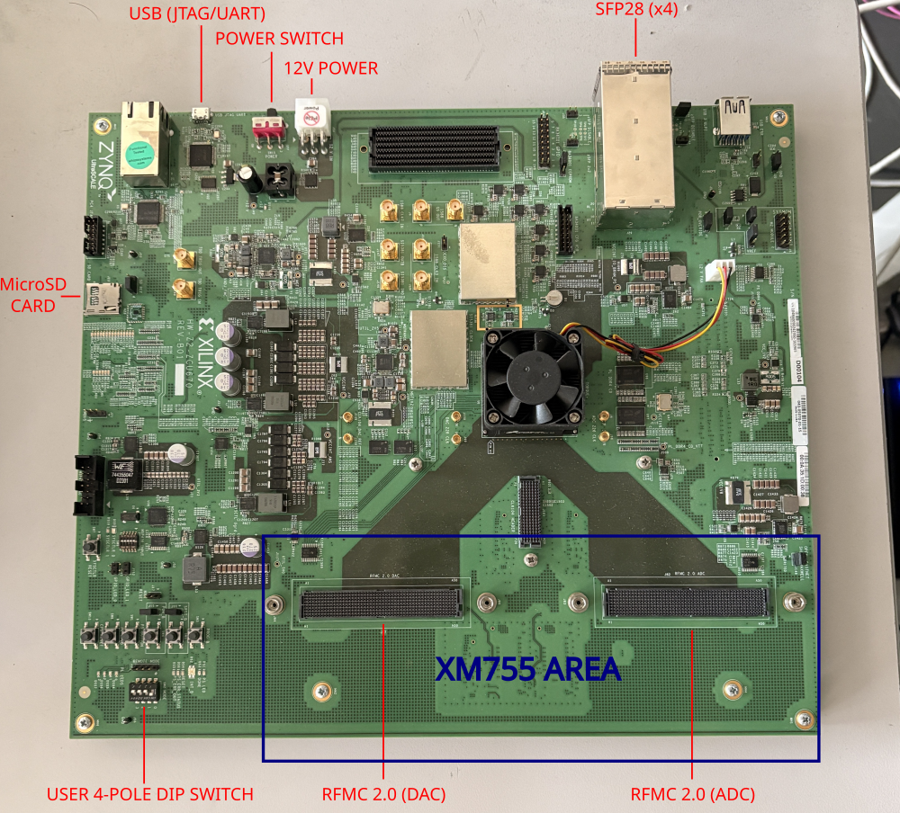
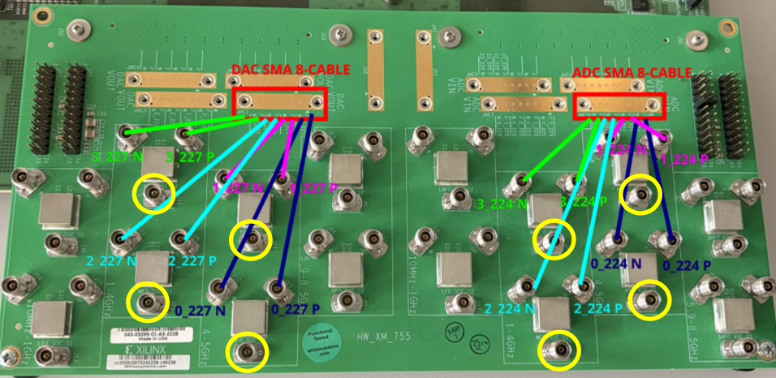
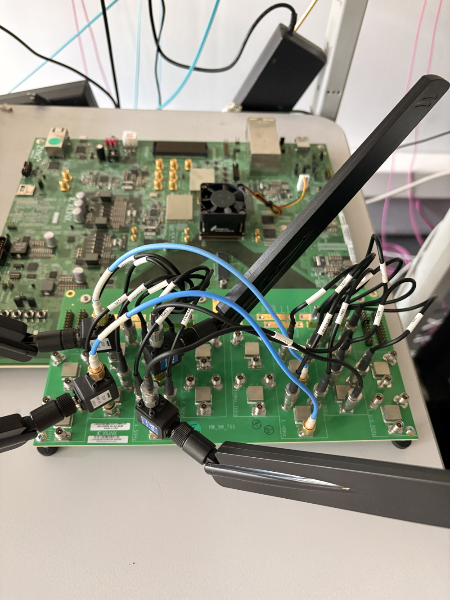
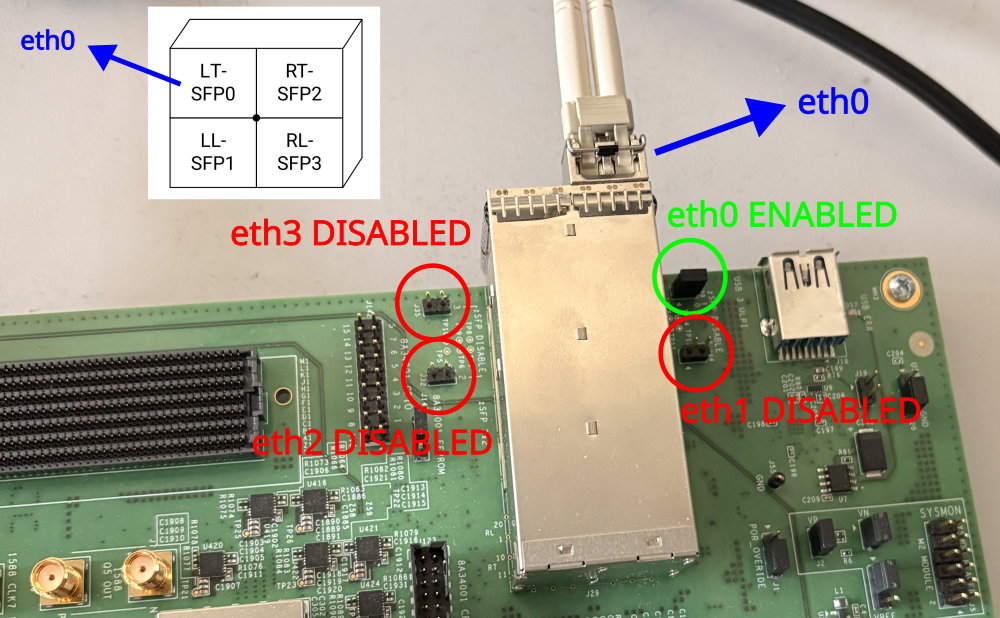
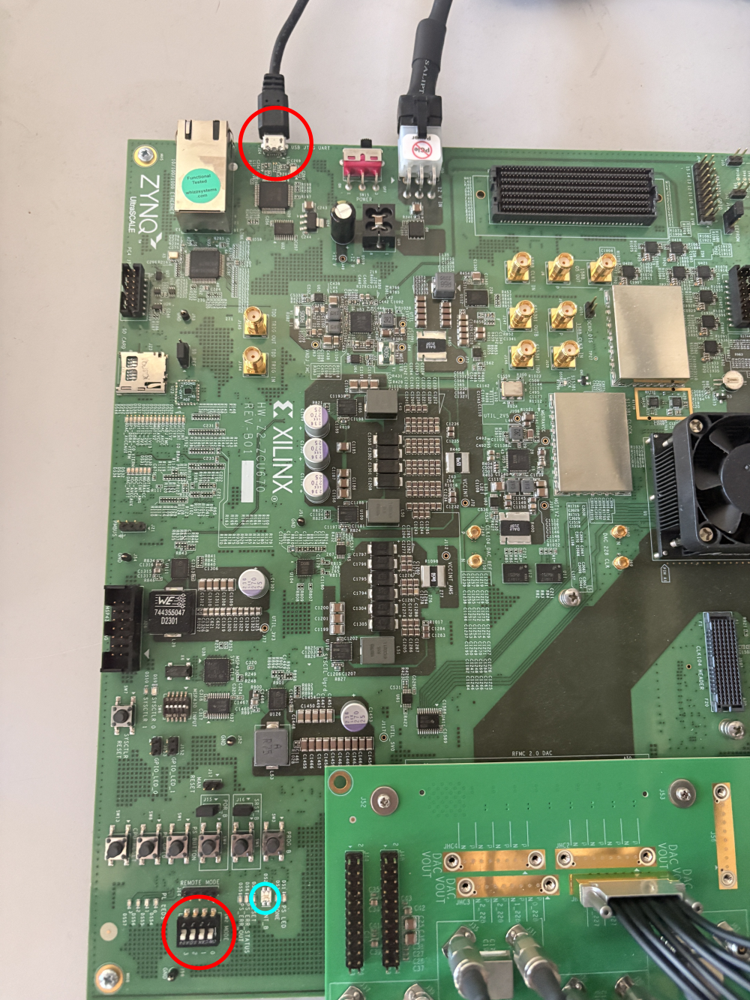
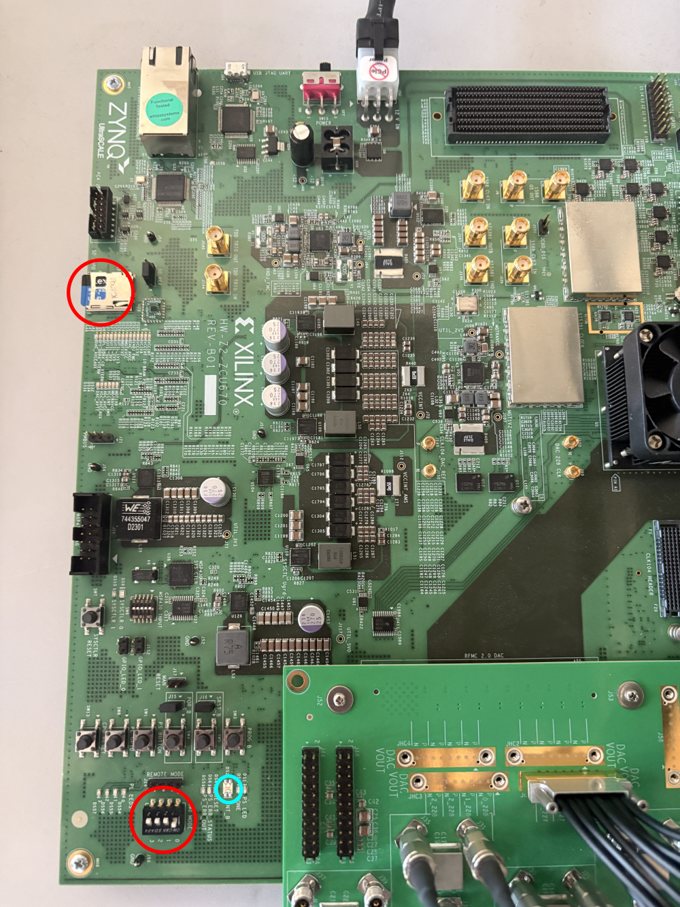
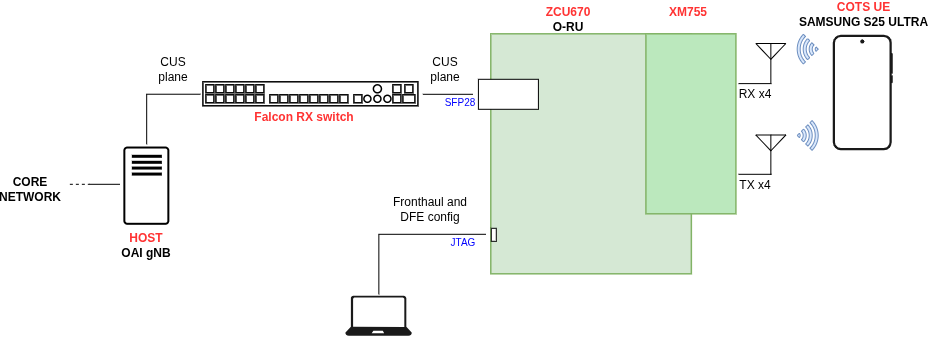
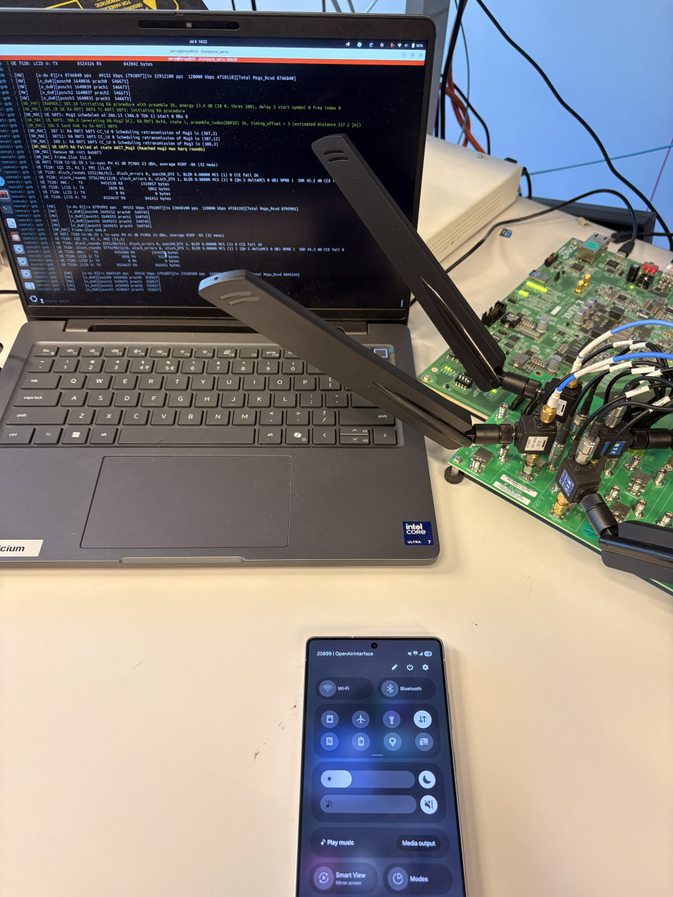

# Configuration and Usage Guide: Interfacing the AMD Zynq™ UltraScale+™ RFSoC DFE ZCU670 Evaluation Kit Target Reference Design (TRD) with OAI
This document provides a step-by-step guide for configuring and interfacing the AMD Zynq™ UltraScale+™ RFSoC DFE ZCU670 Evaluation Kit TRD with the OAI gNB stack. The ultimate objective of this deployment is to establish end-to-end network connectivity with a Commercial Off-The-Shelf User Equipment (COTS UE), using the ZCU670 evaluation board as a Cat-A O-RU.

Target Specifications:
- ZCU670 evaluation board as a 4x4 Cat-A O-RU 
- Channel Bandwidth: 100 MHz, Single Component Carrier, numerology 1
- Operating Frequency: Band n77, 3.9504 GHz center frequency
- FPGA image: TRD prebuilt image (zcu670_rfsoc_dfe4x2111p1222bw983_fcmcd_emcp_oran1z_agc_unif)

**NOTE**: AMD provides images for 2x2, 4x4, and 8x8 configurations. While this guide focuses on the 4x4 setup, the procedures described apply to the other configurations as well.

## Table of Contents
1. [Evaluation kit Setup](#1-evaluation-kit-setup)
   * 1.1 [Setting up the XM755](#11-setting-up-the-xm755)
   * 1.2 [Setting up the Quad zSFP connector](#12-setting-up-the-quad-zsfp-connector)
   * 1.3 [Boot images](#13-boot-images)
   * 1.4 [System Boot Switch Configuration](#14-system-boot-switch-configuration)
2. [RU configuration](#2-ru-configuration)
3. [gNB configuration](#3-gnb-configuration)
4. [The full setup](#4-the-full-setup)
   * 4.1 [Expected result on the O-RU's O-RAN counters](#41-expected-result-on-the-o-rus-o-ran-counters)
   * 4.2 [Expected result on the gNB logs when the UE is connected](#42-expected-result-on-the-gnb-logs-when-the-ue-is-connected)


# 1. Evaluation kit Setup



The primary I/O interfaces used in this tutorial are:
- 1x SFP28 for 25G Ethernet connection to DU
- USB (JTAG/UART) for Fronthaul and DFE chain configuration
- MicroSD Card for System boot image
- User 4-pole DIP switch for selecting the System boot through the MicroSD Card
- XM755 Breakout board for RF interfacing 

## 1.1 Setting up the XM755
The XM755 RFMC 2.0 is a specialized daughtercard bundled with the AMD Zynq™ UltraScale+™ RFSoC DFE ZCU670 Evaluation Kit: https://www.amd.com/en/products/adaptive-socs-and-fpgas/evaluation-boards/zcu670.html

The module acts as an RF breakout board, routing the internal DAC and ADC channels to external SMA connectors. This enables direct interfacing with RF instrumentation, external power amplifiers, or standard laboratory test equipment.

The 4x4 TRD design uses the 4 DACs of the first tile (DAC_T0_CH0, DAC_T0_CH1, DAC_T0_CH2, DAC_T0_CH3), that are mapped to JHC1 in the XM755. And the 4 ADCs of the first tile (ADC_T0_CH0, ADC_T0_CH1, ADC_T0_CH2, ADC_T0_CH3), that are mapped to JHC5.

**NOTE**: On the 2x2 TRD, DAC_T0_CH0, DAC_T0_CH1, ADC_T0_CH0, ADC_T0_CH1 are used

The baluns used for the 1-4 GHz range are: Anaren BD1631J50100AHF  
The baluns used for the 4-5 GHz range are: Anaren BD3150N50100AHF  
For a 4x4 configuration, we opted for the **3.9 GHz to 4 GHz** range.  

Connect the two Carlisle Core HC2 8 Channel cables to the JHC1 and JHC5 headers as illustrated below:



**NOTE**: This tutorial focuses strictly on the interfacing between the TRD and OAI. Because RF performance optimization (i.e. amplification and filtering) is outside the scope of this guide, the RF front-end is bypassed.

The remaining ports circled in yellow will be connected to either 8 antennas (4 TX on the left, and 4 RX on the right) or 4 antennas + 4 circulators.

In our case we are working with **4 antennas and 4 ciruclators**:




## 1.2 Setting up the Quad zSFP connector 
The ZCU670 evaluation board features an integrated quad zSFP/zSFP+ connector cage supporting an aggregate throughput of up to 100 Gbps. For this deployment, fronthaul communication is established over a single 25 Gbps interface (eth0).

The physical ports are housed within a unified 2x2 zSFP cage assembly. Activating and routing data through a specific Ethernet interface requires the manual placement of hardware jumpers on the designated configuration pins surrounding the cage. Refer to the layout below to install the jumper corresponding to the target 25 Gbps port:



## 1.3 Boot images
The prebuilt boot images for the TRD are available on the DFE lounge (Zynq RFSoC DFE Advance Tools Access Secure Site), inside ug1530-zynq-rfsoc-dfe-trd-product-archive-v2-3.zip  
It is possible to boot the system through JTAG or SD card. In this tutorial we are going to use the **SD card** method:  
Creating an SD card for system boot can be done directly by inserting the Micro SD card into a PC, formatting if necessary, and then directly copying the BOOT.BIN, image.ub, and boot.scr files to the primary FAT-32 partition on the SD card.

BOOT.BIN, image.ub, and boot.scr files are located inside
ug1530-zynq-rfsoc-dfe-trd-product-archive-v2-3/sd_products/zcu670_rfsoc_dfe4x2111p1222bw983_fcmcd_emcp_oran1z_agc_unif


## 1.4 System Boot Switch Configuration
The System boot switch must be configured accordingly to the system boot mode (JTAG on the left or SD card on the right)

Once the Power switch is on, after a few seconds, the LED circled in light blue will turn green if the system boot is successful.

<table>
  <tr>
    <td>
      
    </td>
    <td>
      
    </td>
  </tr>
</table>


# 2. RU configuration

In this tutorial, the Fronthaul and DFE chain is configured through the Menu application (Menu.py). Other options are available, for example the M-plane server.

Serial console access to the target is established via the USB (JTAG/UART) interface:

```
sudo screen /dev/ttyUSB1 115200
```

During the system boot up, wait for the ` python3[605]: CRITITCAL ERROR: Unable to Run Pyro Server ` line to appear:

<details>
<summary>System boot logs</summary>

```console
[  OK  ] Finished File System Check on /dev/mmcblk0p1.
[   12.863657] EXT4-fs (mmcblk0p2): mounted filesystem 24ca8032-7cbf-403e-b103-79cb1b2caa85 r/w with ordered data mode. Quota mode: none.
         Mounting /run/media/BOOT-mmcblk0p1...
[  OK  ] Mounted /run/media/rootfs-mmcblk0p2.
[  OK  ] Mounted /run/media/BOOT-mmcblk0p1.
[   13.450539] dpd-startup[599]: --- waiting on 100Mbps/1Gbps Ethernet Link to come Up (19)
[   13.607816] NFSD: Using /var/lib/nfs/v4recovery as the NFSv4 state recovery directory
[   13.615778] NFSD: Using legacy client tracking operations.
[   13.621290] NFSD: starting 90-second grace period (net f0000000)
[FAILED] Failed to start LSB: Kernel NFS server support.
See 'systemctl status nfsserver.service' for details.
[   14.476598] dpd-startup[599]: --- waiting on 100Mbps/1Gbps Ethernet Link to come Up (18)
[   15.502710] dpd-startup[599]: --- waiting on 100Mbps/1Gbps Ethernet Link to come Up (17)
[   16.528951] dpd-startup[599]: --- waiting on 100Mbps/1Gbps Ethernet Link to come Up (16)
[   17.563588] dpd-startup[599]: --- waiting on 100Mbps/1Gbps Ethernet Link to come Up (15)

********************************************************************************************
The PetaLinux source code and images provided/generated are for demonstration purposes only.
Please refer to https://xilinx-wiki.atlassian.net/wiki/spaces/A/pages/2741928025/Moving+from+PetaLinux+to+Production+Deployment
for more details.
********************************************************************************************
PetaLinux 2024.1+release-S05201002 plnx-dpd ttyPS0

plnx-dpd login: [   18.591475] dpd-startup[599]: --- waiting on 100Mbps/1Gbps Ethernet Link to come Up (14)
[   18.851666] python3[605]: CRITITCAL ERROR: Unable to Run Pyro Server.
[   18.852256] python3[605]: No eth0 network interface present.
[   18.852552] python3[605]: Please pass the ipaddress to __init__.py.
[   18.852722] python3[605]: Usage:python3 __init__.py <ipaddress> <port>
[   19.619421] dpd-startup[599]: --- waiting on 100Mbps/1Gbps Ethernet Link to come Up (13)  
```
</details>  
<br>

Then type the following:

```
petalinux
```
and insert the password: plnx

then:
```
sudo systemctl stop raft-startup.service
```
and insert the password: plnx

Now we can change the ethernet configuration:
```
sudo vi /usr/share/middleware/command_files/fh_eth_config.txt
```

As previously stated, we are going to use eth0, so we are going to substitute Fronthaul Ethernet Port 0 Configuration with ours:
```
# Fronthaul Ethernet Port 0 Configuration
set dest_mac_addr 0 00:11:22:33:44:68     # gNB MAC addr
set src_mac_addr 0 00:0a:35:1d:00:38    # ZCU670 evaluation board MAC addr
set vlan 0 13 0 0     # setting up VLAN port 13
```
We are also going to set up the mtu size to 9000:

```
# Set Framer MTU
set mtu_size 9000
```

It is also possible to modify the U-plane/C-plane timing of the O-RU:
```
sudo vi /usr/share/middleware/command_files/fh_delay_profile_config_ant4.txt
```
Where:

**set dl_timing_params <cc> <delay_comp_cp> <delay_comp_up> <advance>**  
- cc: Component carrier to configure  
- delay_comp_cp: Delay compensation for C-Plane (in microseconds) = size of the valid reception window for C-Plane packets, and is equivalent to (i.e. T2A_MAX_CP_DL - T2A_MIN_CP_DL)  
- delay_comp_up: Delay compensation for U-Plane (in microseconds) = size of the valid reception window for U-Plane packets, and is equivalent to (i.e. T2A_MAX_UP - T2A_MIN_UP)  
- advance: Control time advance (in microseconds) (i.e. TCP_ADV_DL)  


**set ul_timing_params <cc> <delay_comp_cp> <advance> <radio_ch_delay>**  
- cc: Component carrier to configure  
- delay_comp_cp: Delay compensation for C-Plane (in microseconds) = size of the valid reception window for C-Plane packets, and is equivalent to (i.e. T2A_MAX_CP_UL - T2A_MIN_CP_UL)  
- advance: Control time advance (in microseconds) (i.e. T2A_MIN_CP_UL)  
- radio_ch_delay: Total delay from output of FH to "air" (in microseconds) = time offset between the 10ms strobe and the actual "air" strobe; it compensates for the system delay for beam-former, DFE, etc.  


For this tutorial, the following parameters have been used:
```
set dl_timing_params 0 30 270 0
set ul_timing_params 0 800 0 123
```

**NOTE**: These parametrs depend on the configuration of the ORAN IP core, as well as the rest of the DFE chain, so particular care must be taken when changing the U-plane/C-plane timing parameters. In the case where not all packets are recived on time by the O-RU, it is therefore suggested to first try to modify the T1a and Ta4 values inside the gnb.conf file, rather than changing the ul_timing_params and dl_timing_params.

Finally, we need to configure the center frequency of the channel, in our case we will set it to 3.9504 GHz:

```
sudo vi /usr/share/middleware/manifest/design_manifest.json
```
And, inside the RFDC settings, insert:

```
"tx_freq_mhz": 3950.400,
"rx_freq_mhz": 3950.400,
```

Now we are ready to open the Applicaion Menu:

```
sudo systemctl start menu-app-startup.service
```

```
sudo menu.py
```

Running the Menu App does the following:
- Set up the Si5381 clocking
- Start the Pyro Server for ORAN and DFE IPs
- Start the PTP

Here is how the Menu App interface should look like for the **4x4 configuration**:

```
--------------------------------
  __  __                                          
 |  \/  |                      /\                 
 | \  / | ___ _ __  _   _     /  \   _ __  _ __   
 | |\/| |/ _ \ '_ \| | | |   / /\ \ | '_ \| '_ \  
 | |  | |  __/ | | | |_| |  / ____ \| |_) | |_) | 
 |_|  |_|\___|_| |_|\__,_| /_/    \_\ .__/| .__/  
                                    | |   | |     
                                    |_|   |_|     

--------------------------------
 1) Check the PTP Log Tail
 2) Get the ORAN Performance Counters
 3) Clear the ORAN Performance Counters
 4) Configuration: cc1_u0_bw50_nocomp
 5) Configuration: cc2_u0_bw100_nocomp
 6) Configuration: cc1_u1_bw100_nocomp
 7) Configuration: cc2_u1_bw200_nocomp
 8) Configuration: cc1_u1_bw100_bfp14
 9) Configuration: cc1_u1_bw100_bfp12
10) Configuration: cc1_u1_bw100_bfp9
11) Configuration: cc2_u1_bw200_bfp14
12) Configuration: cc2_u1_bw200_bfp12
13) Configuration: cc2_u1_bw200_bfp9
99) help
 0) Exit

```

Once the server has started, wait until PTP has synchronised before configuring the system. PTP can be checked by selecting `'1'` in the menu.


<details>
<summary>PTP logs</summary>

```console
MENU-APP> Tail of PTP Log
ptp4l[920.830]: port 1: LISTENING to UNCALIBRATED on RS_SLAVE
ptp4l[921.106]: port 1: UNCALIBRATED to SLAVE on MASTER_CLOCK_SELECTED
ptp4l[921.863]: rms  236 max  330 freq    +48 +/- 202 delay   408 +/-   5
ptp4l[922.873]: rms   60 max   82 freq   +270 +/-  75 delay   411 +/-   2
ptp4l[923.883]: rms   66 max   82 freq   +404 +/-  11 delay   413 +/-   1
ptp4l[924.893]: rms   23 max   40 freq   +397 +/-   9 delay   413 +/-   1
ptp4l[925.902]: rms    3 max    6 freq   +280 +/- 162 delay   413 +/-   1
ptp4l[926.912]: rms    6 max    7 freq     +0 +/-   0 delay   412 +/-   1
ptp4l[927.922]: rms    7 max    8 freq     +0 +/-   0 delay   413 +/-   1
ptp4l[928.931]: rms    8 max    9 freq     +0 +/-   0 delay   413 +/-   1
```

</details>  
<br>

After that, we can configure the board for 1 Component Carrier, numerology 1, 100 MHz channel BW, BFP9 compression, by selecting `'10'` in the menu


# 3. gNB configuration

The OAI configuration file [`gnb.sa.band77.273prb.fhi72.4x4-zcu670EvalBoard.conf`](https://github.com/duranta-project/openairinterface5g/blob/develop/targets/PROJECTS/GENERIC-NR-5GC/CONF/gnb.sa.band77.273prb.fhi72.4x4-zcu670EvalBoard.conf) corresponds to:
- TDD pattern `DDDSU`, 2.5ms
- Bandwidth 100MHz
- MTU 9000
- 4TX4R
- center frequency 3.9504 GHz
- eAxC_offset 8, consistent with the Port configuration of the O-RU in /usr/share/middleware/command_files/fh_eth_config.txt
- no phase compensation (handled by the DFE OFDM block)


# 4. The full setup



The setup consists on:

- System hosting OAI gNB
- Falcon RX Fronthaul switch (LLS-C3 configuration)
- PC connected to the ZCU670 evaluation board through USB (JTAG/UART) to interact with the Menu Application
- ZCU670 evaluation board as O-RU
- XM755 + circulators + antennas as RF frontend
- Samsung S25 Ultra as a Commercial Off The Shelf User Equipment 

We are now ready to run the nr-softmodem from the build directory, and connect the UE to it.

```
cd ~/openairinterface5g/cmake_targets/ran_build/build
sudo ./nr-softmodem -O <configuration file> --thread-pool <list of non isolated cpus>
```

Details about the Core Network setup can be found [here](ttps://github.com/duranta-project/openairinterface5g/blob/develop/doc/NR_SA_Tutorial_OAI_CN5G.md).

## 4.1 Expected result on the O-RU's O-RAN counters
We can check the O-RAN counters by selecting `'2'` on the Menu app:

<details>
<summary>O-RU logs</summary>

```console
MENU-APP> Get the ORAN Performance Counters
{
    "0": {
        "offset_earliest_c_pkt": 13,
        "offset_earliest_u_pkt": 1,
        "oran_rx_bit_rate": 4710748288,
        "oran_rx_corrupt": 0,
        "oran_rx_early": 0,
        "oran_rx_early_c": 0,
        "oran_rx_error_drop": 0,
        "oran_rx_late": 0,
        "oran_rx_late_c": 0,
        "oran_rx_on_time": 500116,
        "oran_rx_on_time_c": 67732,
        "oran_rx_total": 567847,
        "oran_rx_total_c": 67732,
        "oran_tx_total": 250152,
        "oran_tx_total_c": 0,
        "total_rx_bad_fcs_cnt": 0,
        "total_rx_bad_pkt_cnt": 0,
        "total_rx_bit_rate": 4723886848,
        "total_rx_good_pkt_cnt": 568172
    }
}
```
</details>  
<br>

If not all packets are received on time, it's necessary to either change the DU transmission window or the RU reception window, more details can be found in the **WG4 O-RAN Control, User and Synchronization Plane Specification** at  https://specifications.o-ran.org/specifications


## 4.2 Expected result on the gNB logs when the UE is connected

<details>
<summary>gNBlogs</summary>

```console
openair-gnb  | [HW]     [o-du 0][rx 10368849 pps   49151 kbps 1791836][tx 27136100 pps  128000 kbps 4718118][Total Msgs_Rcvd 10368849]
openair-gnb  | [HW]     [o_du0][pusch0 1944164 prach0  648049]
openair-gnb  | [HW]     [o_du0][pusch1 1944167 prach1  648048]
openair-gnb  | [HW]     [o_du0][pusch2 1944164 prach2  648049]
openair-gnb  | [HW]     [o_du0][pusch3 1944158 prach3  648049]
openair-gnb  | [NR_MAC] Frame.Slot 640.0
openair-gnb  | UE RNTI 7520 CU-UE-ID 1 in-sync PH 41 dB PCMAX 23 dBm, average RSRP -92 (32 meas)
openair-gnb  | UE 7520: CQI 7, RI 4, PMI (5,0)
openair-gnb  | UE 7520: dlsch_rounds 27202/726/20/3, dlsch_errors 0, pucch0_DTX 3, BLER 0.09199 MCS (1) 11 CCE fail 41
openair-gnb  | UE 7520: ulsch_rounds 7400/374/45/23, ulsch_errors 17, ulsch_DTX 16, BLER 0.16480 MCS (1) 14 (Qm 6 deltaMCS 0 dB) NPRB 4  SNR 15.5 dB CCE fail 0
openair-gnb  | UE 7520: MAC:    TX      812947153 RX        6247394 bytes
openair-gnb  | UE 7520: LCID 1: TX           1146 RX           6082 bytes
openair-gnb  | UE 7520: LCID 2: TX              0 RX              0 bytes
openair-gnb  | UE 7520: LCID 4: TX      809822719 RX        5027710 bytes
openair-gnb  | 
openair-gnb  | [HW]     [o-du 0][rx 10418001 pps   49152 kbps 1791897][tx 27264100 pps  128000 kbps 4718118][Total Msgs_Rcvd 10418001]
openair-gnb  | [HW]     [o_du0][pusch0 1953380 prach0  651121]
openair-gnb  | [HW]     [o_du0][pusch1 1953383 prach1  651120]
openair-gnb  | [HW]     [o_du0][pusch2 1953380 prach2  651121]
openair-gnb  | [HW]     [o_du0][pusch3 1953374 prach3  651121]
openair-gnb  | [NR_MAC] Frame.Slot 768.0
openair-gnb  | UE RNTI 7520 CU-UE-ID 1 in-sync PH 41 dB PCMAX 23 dBm, average RSRP -92 (32 meas)
openair-gnb  | UE 7520: CQI 7, RI 4, PMI (7,1)
openair-gnb  | UE 7520: dlsch_rounds 28938/728/20/3, dlsch_errors 0, pucch0_DTX 3, BLER 0.02378 MCS (1) 11 CCE fail 41
openair-gnb  | UE 7520: ulsch_rounds 7596/374/45/23, ulsch_errors 17, ulsch_DTX 16, BLER 0.04189 MCS (1) 16 (Qm 6 deltaMCS 0 dB) NPRB 177  SNR 17.0 dB CCE fail 0
openair-gnb  | UE 7520: MAC:    TX      877061146 RX        6534685 bytes
openair-gnb  | UE 7520: LCID 1: TX           1149 RX           6104 bytes
openair-gnb  | UE 7520: LCID 2: TX              0 RX              0 bytes
openair-gnb  | UE 7520: LCID 4: TX      873792215 RX        5234930 bytes
openair-gnb  | 
openair-gnb  | [HW]     [o-du 0][rx 10467153 pps   49152 kbps 1791897][tx 27392100 pps  128000 kbps 4718118][Total Msgs_Rcvd 10467153]
openair-gnb  | [HW]     [o_du0][pusch0 1962596 prach0  654193]
openair-gnb  | [HW]     [o_du0][pusch1 1962599 prach1  654192]
openair-gnb  | [HW]     [o_du0][pusch2 1962596 prach2  654193]
openair-gnb  | [HW]     [o_du0][pusch3 1962590 prach3  654193]
```
</details>  
<br>

